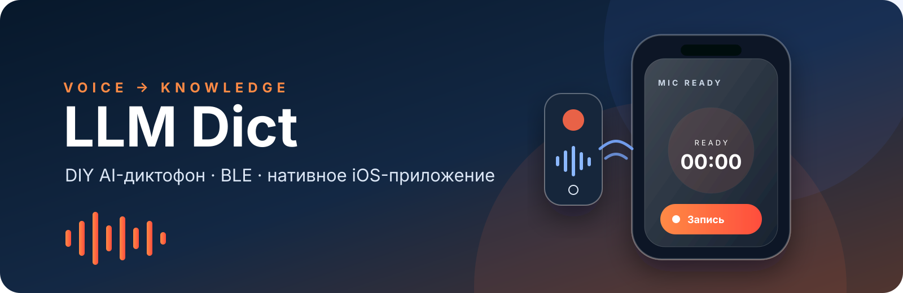
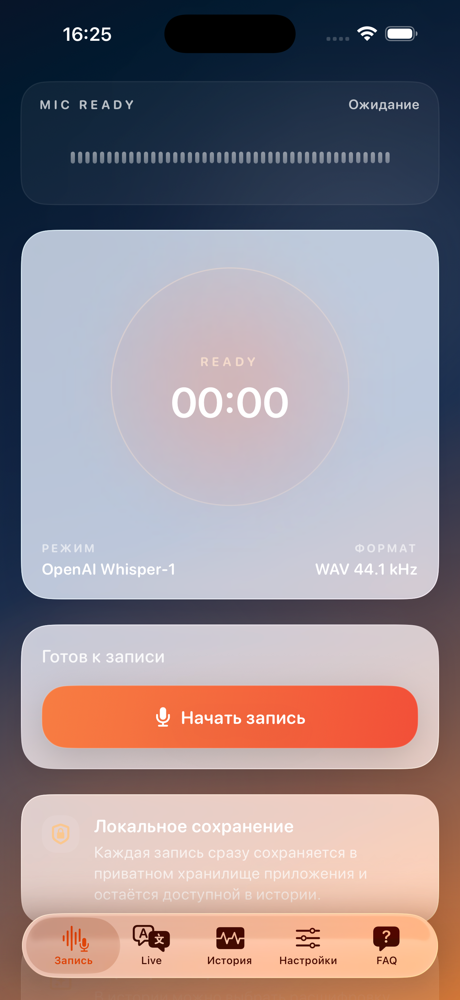
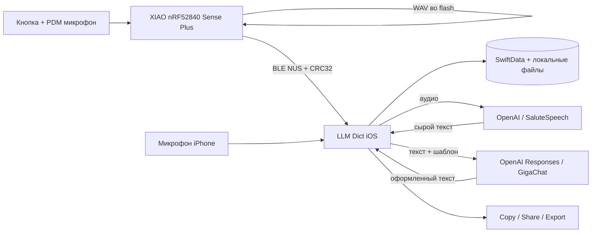

<p align="center">
  
</p>

<h1 align="center">LLM Dict</h1>

<p align="center">
  Компактный DIY-диктофон с BLE-синхронизацией и нативным iOS-приложением:<br>
  записывает речь, переносит WAV на iPhone, расшифровывает и превращает её в структурированный текст.
</p>

<p align="center">
  
  
  
  
  
  <a href="https://github.com/travinov/LLMDICT/actions/workflows/firmware.yml"></a>
</p>

> [!IMPORTANT]
> Это инженерный MVP, вдохновлённый сценарием персональных AI-диктофонов. Проект не связан с PLAUD и не является готовым серийным изделием. Текущая прошивка хранит одну завершённую запись длительностью до 60 секунд.

## Что уже работает

| Уровень | Возможности |
| --- | --- |
| Устройство | Запись с встроенного PDM-микрофона, кнопка старт/стоп, WAV 16 кГц / 16 бит / mono, хранение во встроенной QSPI flash, USB и BLE-выгрузка |
| iOS | Запись с iPhone, подключение к `LLM Dict Recorder`, проверка размера и CRC32, история на SwiftData, воспроизведение, импорт, экспорт и повторная обработка |
| AI | Распознавание через OpenAI или Sber SaluteSpeech; отдельное оформление текста через OpenAI Responses API или GigaChat |
| Privacy | Аудио и история локальны по умолчанию; API-ключи сохраняются в Keychain на конкретном iPhone |

<p align="center">
  
</p>

## Быстрый старт

1. Соберите минимальный комплект по [списку компонентов](hardware/BOM.md) и соедините кнопку `D10 ↔ GND` по [инструкции сборки](hardware/ASSEMBLY.md).
2. Установите Arduino CLI и прошейте плату по [пошаговой инструкции](docs/FIRMWARE_FLASHING.md).
3. Установите приложение на iPhone через Xcode и включите Developer Mode по [инструкции для iOS](docs/IOS_DEVELOPER_INSTALL.md).
4. В приложении откройте **Настройки**, добавьте ключ выбранного провайдера, затем подключите устройство в разделе **Диктофон**.

```bash
git clone https://github.com/travinov/LLMDICT.git
cd LLMDICT

# Подготовить toolchain и собрать прошивку
./scripts/firmware.sh setup
./scripts/firmware.sh build

# Открыть готовый iOS-проект
open apps/ios/LLMDictiOS.xcodeproj
```

## Как устроен проект



```text
LLMDICT/
├── apps/
│   ├── ios/                 # актуальное SwiftUI-приложение и тесты
│   └── android-legacy/      # сохранённый ранний Android-прототип
├── firmware/                # recorder, diagnostic и flash probe
├── hardware/                # BOM и сборка прототипа
├── scripts/                 # сборка/прошивка и USB-выгрузка WAV
└── docs/                    # протокол, установка и архитектурные материалы
```

## Документация

- [Полный список компонентов](hardware/BOM.md)
- [Сборка устройства и распиновка](hardware/ASSEMBLY.md)
- [Установка toolchain и прошивка](docs/FIRMWARE_FLASHING.md)
- [Установка iOS-приложения в Developer Mode](docs/IOS_DEVELOPER_INSTALL.md)
- [BLE protocol v1](docs/BLE_PROTOCOL.md)
- [Архитектура и поток данных](docs/ARCHITECTURE.md)
- [Отчёт о проверке опубликованного snapshot](docs/VERIFICATION.md)
- [Текущий план развития](docs/IMPLEMENTATION_PLAN.md)
- [Правила безопасной работы с ключами](SECURITY.md)

## Ограничения MVP

- Во встроенной flash хранится только одна завершённая запись, максимум 60 секунд.
- Потеря питания до второго нажатия кнопки оставляет WAV незавершённым; такая запись не предлагается для загрузки.
- Корпус, автономное питание и сертификация не входят в проверенную эталонную сборку.
- Для установки iOS-приложения без App Store нужен Mac с Xcode. Бесплатная Personal Team требует повторной установки приложения каждые 7 дней.
- Облачное распознавание передаёт выбранному провайдеру аудио или текст согласно его условиям. Региональная доступность API может отличаться.
- Live Transcribe находится в исходниках как экспериментальная функция, но не включён в основной production flow.

## Разработка и проверки

```bash
# iOS: пересоздать Xcode project (необязательно, нужен XcodeGen)
cd apps/ios
xcodegen generate --spec project.yml

# iOS: тесты в доступном симуляторе
xcodebuild -project LLMDictiOS.xcodeproj -scheme LLMDictiOS \
  -destination 'platform=iOS Simulator,name=iPhone 17 Pro,OS=latest' test

# Firmware: воспроизводимая сборка
cd ../..
./scripts/firmware.sh setup
./scripts/firmware.sh build
```

Исторический Android-прототип сохранён для трассируемости миграции, но активная продуктовая ветка — **iOS + BLE recorder**.

## Безопасность и вклад

Не коммитьте API-ключи, provisioning profiles, записи пользователей и диагностические логи. Обнаруженные проблемы безопасности сообщайте по процессу из [SECURITY.md](SECURITY.md). Перед вкладом прочитайте [CONTRIBUTING.md](CONTRIBUTING.md).

Лицензия на публичное переиспользование пока не объявлена; до появления файла `LICENSE` все права сохраняются за владельцем репозитория.
